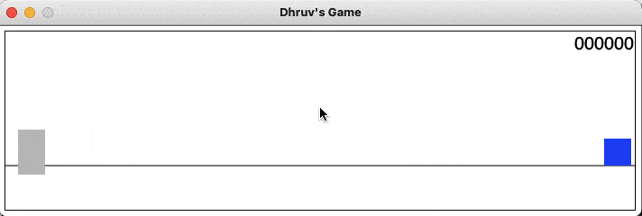

# Dino Game Clone

dodge obstacles as you run



## how to run

- download [Racket](https://racket-lang.org/download/) and either:
    - open and run `Runner Game.rkt` in DrRacket
    - add Racket to your path and run
      ```
      racket Runner\ Game.rkt
      ```
- enjoy!

## how to play

- avoid incoming obstacles by jumping over them or ducking under them
- use space or the up arrow key to jump
- use the down arrow key to duck

test driven development was drilled into me in C211, but unfortunately I got lost in the sauce and failed to test
